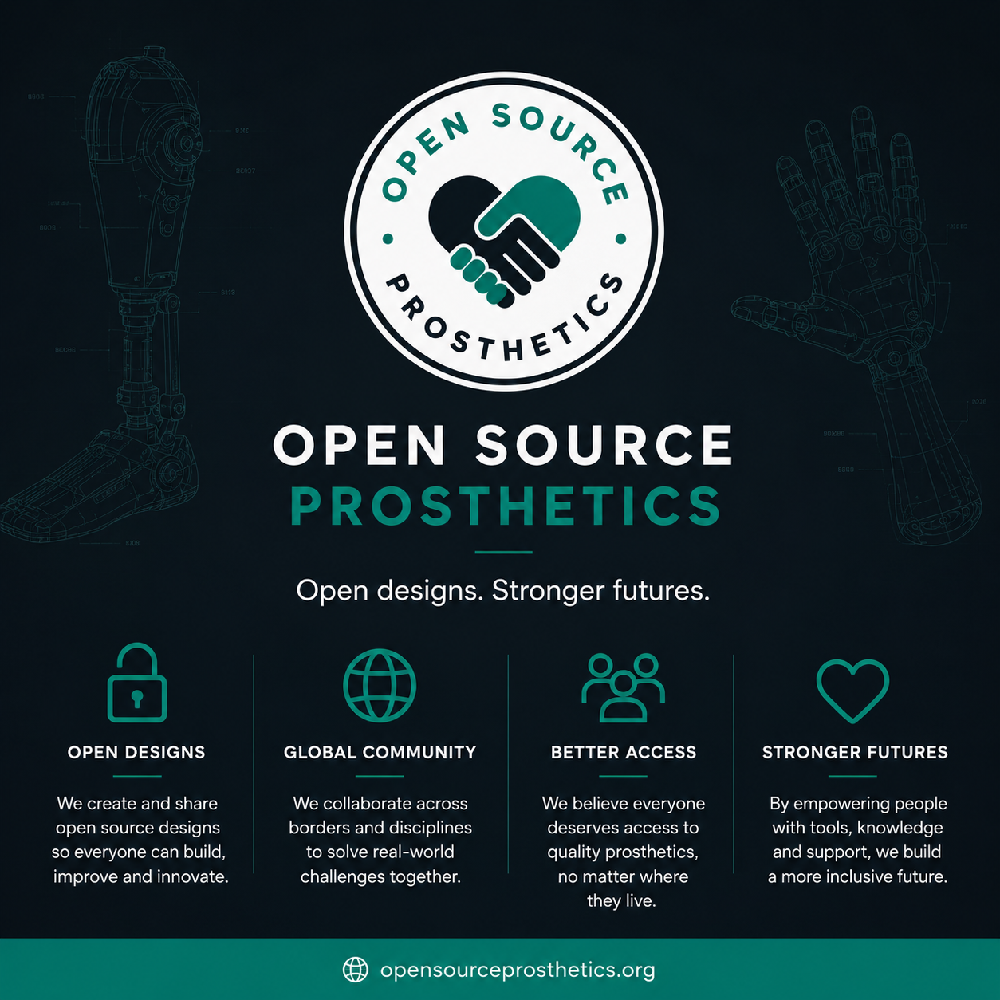

# Open Source Prosthetics

We provide free or ultra-low-cost, functional upper-limb assistive devices to underserved populations in South Africa through distributed 3D printing and clinical partnerships.

Visit our website at https://opensourceprosthetics.org/ alternativly, have a look at our Open Collective page: https://opencollective.com/open-source-prosthetics

`

---
